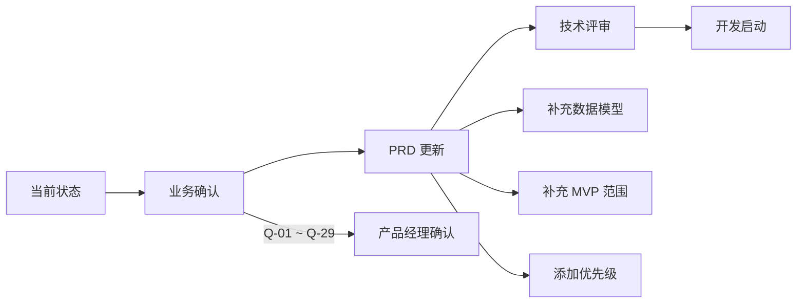

# Scriba APP PRD 评审报告

**评审版本**: v1.0  
**评审日期**: 2025-12-09  
**评审对象**: [Scriba_APP_PRD.md](file:///c:/work/code/scriba/docs/Scriba_APP_PRD.md)

---

## 1. 整体评价

| 维度 | 评分 | 说明 |
|-----|------|------|
| 文档结构 | ⭐⭐⭐⭐ | 结构清晰，章节划分合理 |
| 功能覆盖 | ⭐⭐⭐ | 核心流程完整，但细节不足 |
| 技术可行性 | ⭐⭐⭐ | 缺少技术约束和接口定义 |
| 业务完整性 | ⭐⭐ | 多处业务规则待确认 |
| 可执行性 | ⭐⭐ | 需补充优先级和迭代规划 |

---

## 2. 需要确认的业务需求

> [!IMPORTANT]
> 以下问题需要产品/业务方确认后方可进入开发阶段

### 2.1 用户角色与权限体系

| 问题ID | 问题描述 | 影响范围 | 优先级 |
|--------|---------|---------|--------|
| Q-01 | PT/OT 角色之间的功能差异具体是什么？只是推荐模板不同，还是有权限区别？ | 用户系统、模板系统 | 高 |
| Q-02 | 是否存在其他角色（如管理员、机构所有者）？这些角色的功能权限如何定义？ | 用户系统、权限系统 | 高 |
| Q-03 | 用户是否可以更改角色？更改后历史数据如何处理？ | 用户系统 | 中 |

### 2.2 Badge 硬件相关

| 问题ID | 问题描述 | 影响范围 | 优先级 |
|--------|---------|---------|--------|
| Q-04 | Badge 的具体规格和通信协议是什么？（BLE 版本？自定义协议？） | 蓝牙模块 | 高 |
| Q-05 | "主 Badge" 概念的具体行为是什么？如果多个 Badge 同时在线，音频混合还是主 Badge 优先？ | 音频录制 | 高 |
| Q-06 | Badge 电量低时（如 <10%）的行为策略是什么？ | 设备管理 | 中 |
| Q-07 | 是否需要 Badge OTA（空中升级）功能？ | 设备管理 | 中 |
| Q-08 | Badge 离线缓存能力如何？音频数据是否在 Badge 端有缓存？ | 音频录制 | 中 |

### 2.3 录音与存储

| 问题ID | 问题描述 | 影响范围 | 优先级 |
|--------|---------|---------|--------|
| Q-09 | 单次录音的最大时长限制是多少？ | 录音模块 | 高 |
| Q-10 | 录音文件格式（WAV/AAC/Opus）和采样率/比特率要求？ | 音频处理、存储 | 高 |
| Q-11 | 本地存储配额上限是多少？超出后的清理策略？ | 存储管理 | 高 |
| Q-12 | "自动保存草稿" 的触发间隔是多少？ | 录音模块 | 中 |
| Q-13 | 录音文件命名规则是什么？用户可自定义还是系统生成？ | 录音模块 | 低 |

### 2.4 AI 后处理

| 问题ID | 问题描述 | 影响范围 | 优先级 |
|--------|---------|---------|--------|
| Q-14 | STT 服务商选择？（Google/AWS/Azure/私有部署） | AI 系统、成本 | 高 |
| Q-15 | 支持的语言有哪些？是否支持多语言混合识别？ | AI 系统 | 高 |
| Q-16 | "医疗模板" 的具体结构和字段定义？ | 报告系统 | 高 |
| Q-17 | 自动摘要的目标长度范围？ | AI 系统 | 中 |
| Q-18 | AI 处理失败后的 "人工模式" 是指用户手动输入还是后台人工审核？ | AI 系统、运营 | 中 |
| Q-19 | AI 是否采用混合部署（云端 + 边缘）？ | 架构设计 | 中 |

### 2.5 数据安全与合规

| 问题ID | 问题描述 | 影响范围 | 优先级 |
|--------|---------|---------|--------|
| Q-20 | 目标市场的合规要求？（HIPAA？GDPR？澳洲 Privacy Act？） | 全系统 | **关键** |
| Q-21 | 录音数据的生命周期管理（保留期限、自动删除策略）？ | 存储、合规 | 高 |
| Q-22 | 是否需要审计日志？用户删除数据时的处理流程？ | 后端系统 | 高 |
| Q-23 | AES-256 加密的具体应用场景（传输/存储/端到端）？ | 安全系统 | 高 |

### 2.6 离线场景

| 问题ID | 问题描述 | 影响范围 | 优先级 |
|--------|---------|---------|--------|
| Q-24 | 完全离线时可以使用哪些功能？ | 全系统 | 高 |
| Q-25 | 离线录音的数量/总时长上限？ | 录音模块 | 中 |
| Q-26 | 重新联网后的同步优先级和策略？ | 同步系统 | 中 |

### 2.7 机构功能

| 问题ID | 问题描述 | 影响范围 | 优先级 |
|--------|---------|---------|--------|
| Q-27 | 是否需要机构管理员端？（PRD 开放问题 #3） | 产品范围 | 高 |
| Q-28 | 用户加入机构的流程？邀请码？管理员审批？ | 用户系统 | 中 |
| Q-29 | 机构内数据共享规则？ | 权限系统 | 中 |

---

## 3. 建议补充的文档内容

### 3.1 缺失模块

| 模块 | 重要性 | 建议内容 |
|-----|--------|---------|
| **用户故事** | 高 | 增加具体的用户故事，如 "作为 PT，我希望在评估结束后立即获得结构化报告" |
| **数据模型** | 高 | 添加核心数据实体定义（User、Recording、Report、Organization 等） |
| **API 需求** | 中 | 定义前后端接口的大致范围和关键接口 |
| **版本规划** | 高 | MVP 包含哪些功能？未来迭代规划？ |
| **竞品分析** | 中 | 与同类产品的差异化定位 |
| **成功指标** | 中 | 如何衡量产品成功（DAU、录音数、AI 使用率等） |
| **通知策略** | 低 | Push 通知的场景和内容 |
| **国际化** | 中 | 是否需要多语言 UI？初期支持哪些语言？ |

### 3.2 格式一致性问题

> [!NOTE]
> 以下为文档格式建议，不影响业务理解

1. **2.7 节缺少 "流程阶段" 和 "流程内容"**：与 2.1-2.6 节格式不一致
2. **功能需求清单（第 3 节）过于简化**：表格中的内容太简略，建议展开或链接到详细功能说明
3. **缺少功能优先级标注**：建议为功能需求添加 P0/P1/P2 优先级

### 3.3 NFR 需要更精确的定义

| 当前描述 | 建议补充 |
|---------|---------|
| 冷启动 < 1.5 秒 | 测量条件：设备型号（如 iPhone 12+）、网络状态（WiFi/4G/离线） |
| 录音延迟 < 50ms | 从按下按钮到开始采集音频的延迟 |
| AI 延迟 < 12 秒 | 针对多长录音？（如 5 分钟录音） |
| 上传重试 3 次 | 重试间隔策略（指数退避？固定间隔？） |

---

## 4. 新增开放问题建议

原文档已有 4 个开放问题，建议增加以下问题：

| 问题ID | 问题内容 | 关联模块 |
|--------|---------|---------|
| OQ-05 | 是否需要支持 Apple Watch / WearOS？ | 平台扩展 |
| OQ-06 | 录音回放功能是否需要变速、分段标记？ | 录音模块 |
| OQ-07 | 是否需要支持多人协作（同一录音多人编辑）？ | 协作功能 |
| OQ-08 | AI 生成内容是否需要与 EMR/EHR 系统集成？ | 系统集成 |
| OQ-09 | 是否需要支持录音转发/分享给同事？ | 分享功能 |
| OQ-10 | 是否支持报告导出 PDF？（PRD 开放问题 #4 的扩展：导出格式、模板自定义？） | 导出功能 |

---

## 5. 下一步行动建议

### 建议优先级：

1. **立即确认（阻塞开发）**：
   - Q-20：合规要求（HIPAA/GDPR）
   - Q-09、Q-10：录音规格
   - Q-14、Q-15：AI 服务商和语言支持

2. **尽早确认（影响架构）**：
   - Q-04、Q-05：Badge 硬件协议
   - Q-01、Q-02：用户角色体系
   - Q-16：医疗模板结构

3. **可后续确认（MVP 可暂不实现）**：
   - Q-27、Q-28、Q-29：机构功能
   - Q-07：Badge OTA

---

## 附录：评审检查清单

| 检查项 | 状态 | 备注 |
|-------|------|------|
| 产品定位清晰 | ✅ | - |
| 用户流程完整 | ✅ | 部分细节待补充 |
| 功能需求明确 | ⚠️ | 需补充优先级和详细描述 |
| 非功能需求量化 | ⚠️ | 需补充测量条件 |
| 数据模型定义 | ❌ | 缺失 |
| 安全合规要求 | ⚠️ | 需确认具体法规 |
| 版本规划 | ❌ | 缺失 |
| 边界条件说明 | ⚠️ | 部分场景待补充 |

---

*评审完成，请产品方针对第 2 节的问题进行确认，确认后可更新 PRD 并进入技术评审阶段。*
